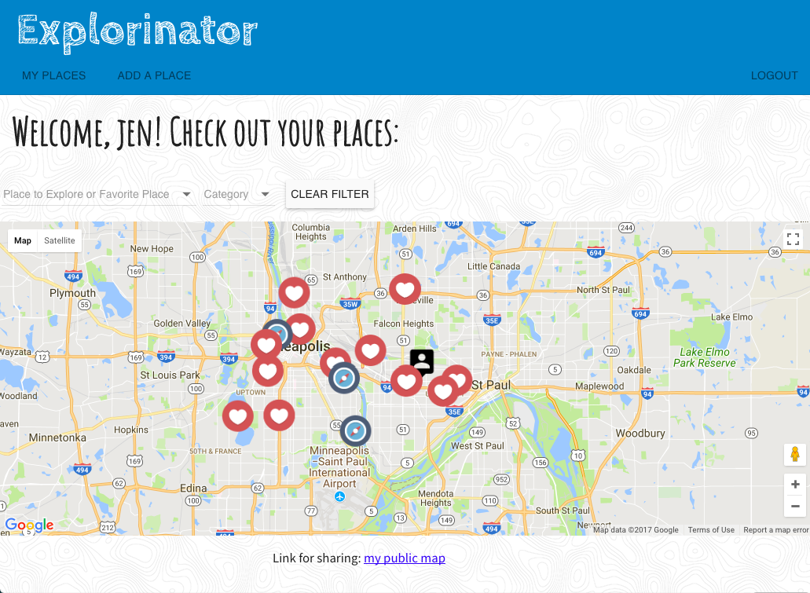
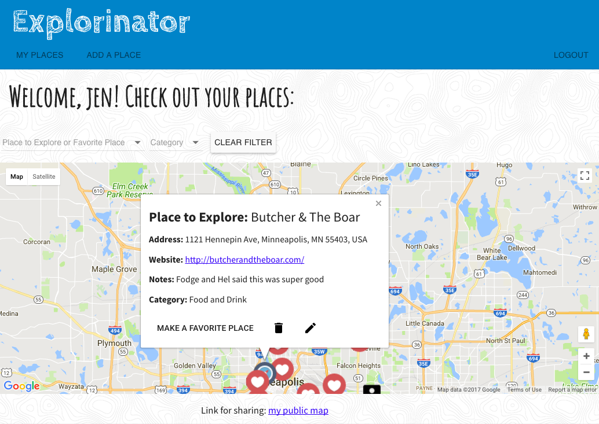
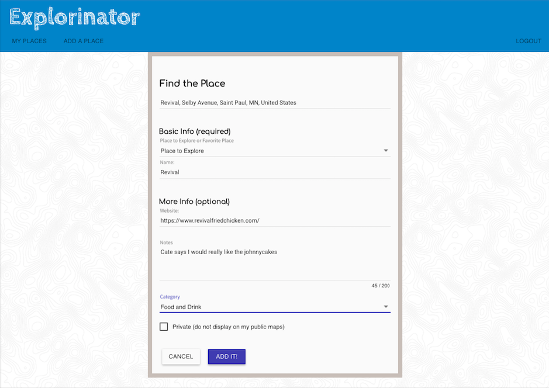
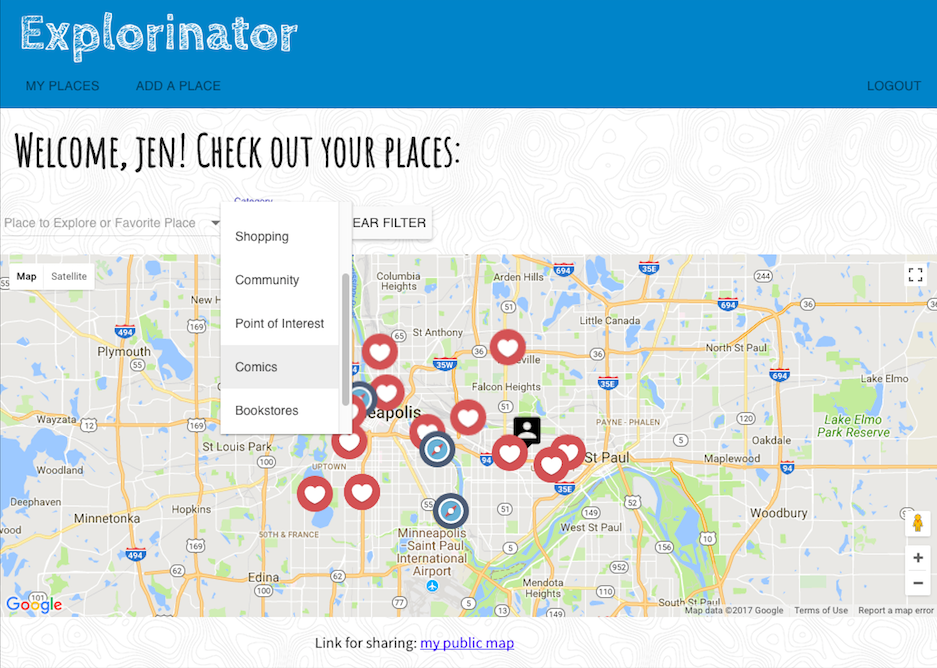

# Explorinator

There are too many cool places to be able to remember all of them. Often we forget places that people suggest to us, or we forget places that we love when we are asked for recommendations.

Explorinator is an app that lets users save and share the places that they love and places that they want to explore to their own map. Users can add notes and custom categories, and decide which places they want to display on their public map for friends to see.

[https://explorinator.herokuapp.com/](https://explorinator.herokuapp.com/)

**Main map view**

**View details about your places**

**Add places with Google Places Autocomplete**

**Create custom categories** 

## Built With

Technologies used: JavaScript, MEAN Stack (mongoDB, Express, AngularJS, Node.js), Google Maps API, Google Places API, AngularJS Material, Passport

## Getting Started

These instructions will get you a copy of the project up and running on your local machine for development and testing purposes. See deployment for notes on how to deploy the project on a live system.

### Prerequisites

- [Node.js](https://nodejs.org/en/)
- Other dependencies as listed in package.json

### Installing

Download code, npm install dependencies

### Completed Features

High level list of items completed.

- [x] Users can add places to their map via google places search
- [x] Users can edit places on their map
- [x] Users can easily change Place to Explore to Favorite Place
- [x] Users can add custom categories
- [x] Non-users can view user's places on the user's public map

### Next Steps

Features that you would like to add at some point in the future.

- [ ] Users can become friends with other users, friends can add places to each other's maps
- [ ] Users can add places using current location or marker drop
- [ ] Increased search/filtering function for map
- [ ] Alerts when user is near a marked Place to Explore

## Authors

Jen Show

